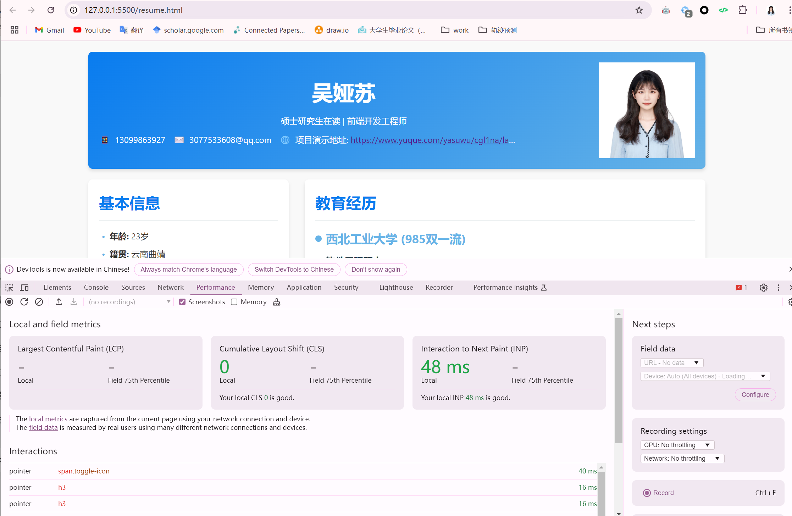
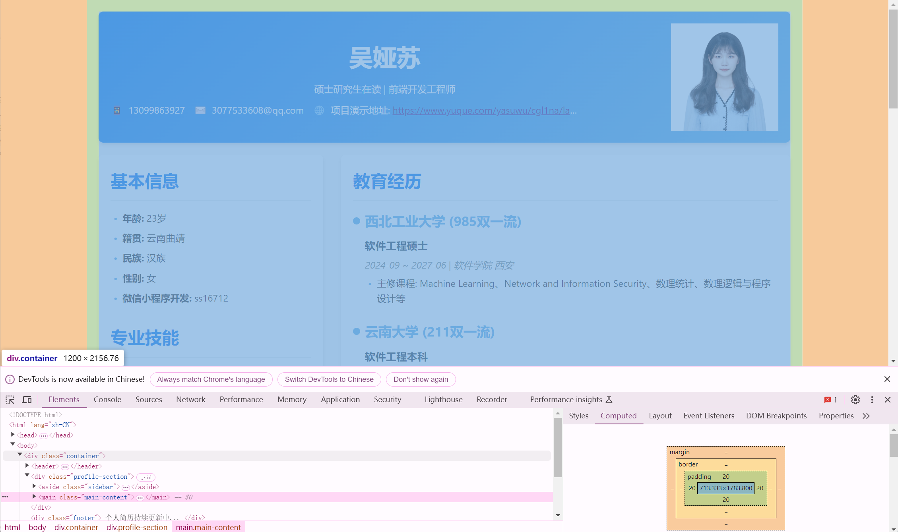

## 吴娅苏 - 个人简历项目

这是一个使用纯HTML、CSS和JavaScript实现的个人简历单页应用。

### 项目特色

-  ✅ 纯前端实现 - 无需任何框架或外部依赖

-  ✅ 响应式设计 - 适配桌面端和移动端

-  ✅ 语义化HTML - 使用HTML5语义化标签

-  ✅ CSS Grid/Flex布局 - 现代化布局技术

-  ✅ 交互功能 - 项目经历可展开/折叠

-  ✅ 打印友好 - 优化打印样式

### 技术栈

-  HTML5 - 语义化标签和文档结构

-  CSS3 - Grid布局、Flexbox、CSS变量、媒体查询

-  JavaScript - DOM操作和交互功能

### 功能特性

#### 布局特性

-  两栏式布局（侧边栏+主内容区）

-  响应式设计，支持移动端适配

-  侧边栏粘性定位

#### 交互功能

-  项目经历展开/折叠动画

-  平滑的过渡效果

-  图标旋转指示器

#### 视觉设计

-  CSS变量主题系统

-  现代化UI设计

-  打印样式优化


### 自定义配置

#### 修改主题颜色

在CSS的 :root 部分修改CSS变量：
```css
:root {
    --primary-color: #097cef;    /* 主色调 */
    --secondary-color: #66b3e7;  /* 辅助色 */
    --accent-color: #e74c3c;     /* 强调色 */
    /* 更多颜色变量... */
}
```

#### 添加新项目

在HTML的 #projects 部分添加新的项目块：
```html
<div class="project-item">
    <div class="project-header">
        <h3>项目标题</h3>
        <span class="toggle-icon">◀</span>
    </div>
    <div class="project-content">
        <!-- 项目内容 -->
    </div>
</div>
```


### 浏览器兼容性
-  Chrome 60+

-  Firefox 55+

-  Safari 12+

-  Edge 79+

### 样式架构

-  使用CSS变量实现主题系统

-  模块化CSS组织

-  移动优先的响应式设计

### JavaScript功能

-  纯原生JavaScript实现

-  事件委托处理

-  平滑动画过渡

### 页面性能



### 项目布局
